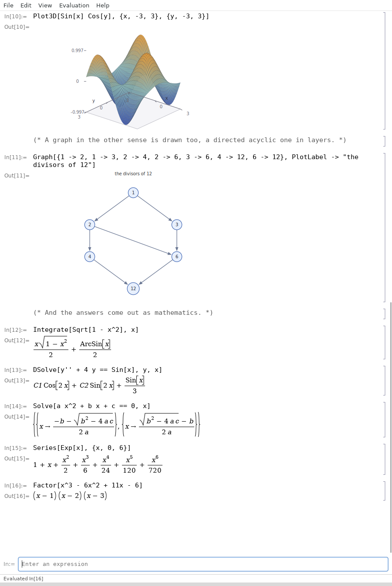

# Math42

[](https://github.com/office-42/math42/actions/workflows/linux.yml)
[](https://github.com/office-42/math42/actions/workflows/windows.yml)
[](https://github.com/office-42/math42/actions/workflows/macos.yml)

A mathematics notebook in the shape of Mathematica and MATLAB, written
in C on GTK 4, Pango and Cairo. A sibling of
[office42](https://github.com/office-42/office42).



The window is a notebook: type an expression on the input line, press
Enter, and an `In[n]:=` / `Out[n]=` pair is added to the page. Results
are set as mathematics — an integral under its sign with its limits, a
sum under sigma, a derivative in Leibniz's notation, fractions
stacked, powers raised, roots under a radical, matrices in brackets,
graphs drawn — not printed as text.

Both languages are spoken. Mathematica's `Sin[Pi/2]`, `#^2 &`, `/@`,
`@@`, `//` and `x[[2 ;; 4]]` work, and so do MATLAB's `sin(pi/2)`,
`A(2, :)`, `x(end)`, `sprintf` and `for i = 1:5, … end`. The spelling
decides the dialect: `Sqrt[2]` is √2 and `Sin[Pi]` is 0, while
`sqrt(2)` is 1.4142135623731 and `sin(pi)` is 1.2246e-16, exactly as
each language reports them.

**A detailed [user guide](docs/USER-GUIDE.md)** covers the language,
every group of functions, a course-by-course map of the mathematics an
NTNU engineering degree teaches — Matte 1 to 4 and Diskret matematikk
— and both compatibility tables.

## What works today

**Transforms.** `LaplaceTransform[t Exp[3t], t, s]` is `1/(s - 3)^2`,
and `InverseLaplaceTransform` reads the table the other way, splitting
a quotient of polynomials by partial fractions.
`FourierSeries[x, {x, -Pi, Pi}, 4]` is
`2 Sin[x] - Sin[2 x] + 2 Sin[3 x]/3 - Sin[4 x]/2`, and the discrete
transform is there under both `Fourier` and `fft`.

**Differential equations and recurrences.** `DSolve` solves the linear
equations, general or with initial values: a first order one by its
integrating factor whatever its coefficients, a second order one with
constant coefficients by variation of parameters, so that
`y'' + 4y == Sin[x]` comes out as `C1 Cos[2x] + C2 Sin[2x] + Sin[x]/3`.
`RSolve` turns a recurrence into its closed form. `NDSolve`/`ode45`
walks anything else with Runge-Kutta.

**Several variables.** `Grad`, `Div`, `Curl`, `Laplacian`, `Hessian`,
`Jacobian`, and an integral over more than one range done a variable at
a time.

**Discrete mathematics.** `PowerMod`, `ExtendedGCD`, `ChineseRemainder`,
`FactorInteger`, `EulerPhi`, `Subsets`, `Permutations`, `StirlingS2`,
and graphs held as a matrix with `ConnectedComponents`,
`TransitiveClosure` and `GraphDistance`.

**Symbolic algebra.** A name with no value is a symbol, so `2 x + 1`
stays `2 x + 1`. `D[x^3 + Sin[x], x]` differentiates, to any order with
`D[f, {x, 2}]`. `Integrate[x Exp[x], x]` integrates — the power rule,
sums, constant multiples, `1/(a x + b)`, the standard functions of a
linear argument, polynomials times those by parts, a rational function
by partial fractions, `Sqrt[1 - x^2]` and `Sqrt[x^2 + 1]`, any whole
power of a sine, cosine or tangent, and the two substitutions `f'/f`
and `f^n f'` even when they are out by a number or a minus sign.
`Solve[a x^2 + b x + c == 0, x]` writes out the formula with the
letters still in it. `Expand`
multiplies out and gathers like terms, `Series[Sin[x], {x, 0, 7}]`
gives the Taylor polynomial, `Limit[Sin[x]/x, x -> 0]` is 1,
`Factor[x^3 - 6x^2 + 11x - 6]` is `(x - 1) (x - 2) (x - 3)`,
`Simplify` folds constants and drops the identities,
`TrigReduce` writes a product of waves as a sum of waves and
`TrigExpand` writes it back, and `expr /. x -> 2` puts numbers in.

**Patterns.** A pattern is an expression with holes in it: `x_` stands
for anything, `x_Integer` for anything with that head, `x__` for one
thing or more, `x___` for none or more, and `p /; test` only when the
test holds. Rules read them, so
`Sin[a + b] /. Sin[u_ + v_] -> Sin[u] Cos[v] + Cos[u] Sin[v]` does what
it says; `//.` goes round until nothing changes, which is a whole sort
in one line:
`{5, 3, 4, 1} //. {a___, m_, n_, b___} /; m > n -> {a, n, m, b}`.
`Cases`, `MatchQ`, `Count`, `Position`, `DeleteCases`, `FreeQ`,
`ReplaceAll` and `ReplaceRepeated` all read the same shapes.

**Exact arithmetic.** Whole numbers and their fractions are kept
exactly, so `1/3 + 1/6` is `1/2` and not `0.5`, `2^-3` is `1/8`, and a
notebook shows them stacked the way they are written by hand. A whole
number that outgrows the machine keeps going on its own digits, so
`2^100`, `100!` and `Fibonacci[200]` are exact to the last one.
`N[1/3]` asks for the decimal and `Rationalize[0.25]` asks for the
fraction back. `GCD`, `LCM`, `Binomial`, `PrimeQ`, `Prime` and `Fibonacci` are
there for whole numbers.

**Numerics.** `NDSolve[y - x^2, {x, 0, 4}, 1]` walks a differential
equation with fourth-order Runge-Kutta and hands back the points it
went through, ready for `ListLinePlot`; MATLAB's `ode45` is the same
thing. `Integrate[f, {x, a, b}]` is exact when an antiderivative
is known and Simpson's rule when it is not; `NIntegrate` is always
numeric. `Solve` gives every root of a polynomial, complex ones
included, and sweeps a window for sign changes when the equation is not
one; `FindRoot` and MATLAB's `fzero` polish a single root from a
starting point. `FindMinimum` walks downhill from a starting point and
MATLAB's `fminbnd` closes in between two ends. `Sum`, `Product` and
`Table` do what their names say, and a sum to a named end gets its
closed form: `Sum[i^2, {i, 1, n}]` is `n/6 + n^2/2 + n^3/3`.

**Statistics.** `Mean`, `Median`, `Variance`, `StandardDeviation`,
`Quantile`, `Skewness`, `Kurtosis`, `Correlation`/`corrcoef` and
`Covariance`/`cov`, with `NormalDistribution`, `UniformDistribution`,
`ExponentialDistribution`, `PoissonDistribution` and
`BinomialDistribution` read by `PDF`, `CDF`, `RandomVariate`, `Mean`
and `Variance`.

**Complex numbers.** `I` is the imaginary unit, `Sqrt[-4]` is `2 I`,
`Exp[I Pi]` is `-1`, and `Re`, `Im`, `Abs`, `Arg` and `Conjugate` take
a number apart. The trigonometric, hyperbolic, exponential and
logarithmic functions all accept one.

**Matrices.** Written the MATLAB way, `A = [1 2; 3 4]`, or as lists of
lists. `Det`, `Inverse`, `Transpose` (also `A'`), `Dot` (also `A . B`),
`LinearSolve` (also `A \ b`), `ArrayReshape`/`reshape`,
`DiagonalMatrix`/`diag`, `MatrixPower`, `Rank`, `Tr`, `Norm`, `Cross`,
`IdentityMatrix`/`eye`, `zeros`, `ones`, and `Eigenvalues` — Jacobi
rotations for a symmetric matrix, the QR iteration otherwise, with the
complex pair worked out where a 2×2 block will not split — with
`Eigenvectors` and `Eigensystem` for any matrix whose eigenvalues are
real. The standard
factorings are there as well: `LUDecomposition`/`lu`,
`QRDecomposition`/`qr`, `SingularValueDecomposition`/`svd`,
`PseudoInverse`/`pinv` and `Cond`/`cond`, along with `RowReduce`/`rref`,
`NullSpace`, `Orthogonalize`, `LeastSquares`, `CharacteristicPolynomial`
and `MatrixExp`.

**Programming.** `f[x_] := x^2` and MATLAB's `g = @(x) 2 x` define
functions, and a name may be defined more than once with the fitting
shape chosen — `fib[0] = 0; fib[1] = 1; fib[n_] := fib[n-1] + fib[n-2]`
answers `fib[30]` with `832040`. `Clear[f]` forgets a name again.
`v[[2]] = 9` and `A[[1, 2]] = 7` change one place in a list and leave
the rest, and MATLAB's `v(2) = 9` does the same, making the list longer
when the place is past the end. `If`, `Which`, `For`, `While`, `Do`, `Module` and `Block`
are there, with `Map`, `Select`, `Fold`, `Nest`, `NestList` and
`Apply`, and `Print` writes above the result. Several statements go on
one line separated by `;`, and a trailing `;` hides the answer.

**Lists.** `{1, 2, 3}`, `Range[10]`, MATLAB's `1:2:9`, element-wise
arithmetic and broadcasting, `x[[2]]` and `x(2)` for parts,
`Length`, `Dimensions`/`size`, `Sort`, `Reverse`, `Flatten`, `Join`,
`First`, `Last`, `Rest`, `Append`, `Take`, `Drop`, `Partition`,
`Count`, `Position`/`find`, `Tally`, `Union`, `Intersection`,
`Complement`, `Accumulate`/`cumsum`, `Differences`/`diff`, `AnyTrue`
and `AllTrue`.

**Graphs.** `Plot[Sin[x]/x, {x, -20, 20}]`, several curves at once with
`Plot[{Sin[x], Cos[x]}, {x, 0, 10}]`,
`Plot3D[Sin[x] Cos[y], {x, -3, 3}, {y, -3, 3}]` for a surface drawn in
projection with its mesh and a colour taken from its height,
`ParametricPlot`, `PolarPlot`,
`ContourPlot`/`contour` for the curves along which a function keeps its
value, `ParametricPlot3D` for a curve through space, `VectorPlot`/`quiver`
for a direction field,
`DensityPlot` for the same surface looked straight down on,
`ListPlot3D`, `ListContourPlot` and `ListDensityPlot` for those three
from a grid of numbers, `LogPlot`/`semilogy` and `LogLogPlot`/`loglog` for an axis in
powers of ten,
`ListPlot`, `ListLinePlot`, `BarChart`, `Histogram`, `StemPlot`/`stem`,
`StairsPlot`/`stairs`, `Show` for graphs laid over one another, and
MATLAB's `plot(x, y)` — drawn with Cairo, with ticks that land on round
numbers. Each takes `PlotLabel -> "a title"`,
`AxesLabel -> {"x", "y"}` and `PlotRange -> {lo, hi}`.

**Strings.** `"quoted text"` is a value and `Print["x is ", x]` writes
it above the result. `StringJoin`, `StringLength`, `StringTake`,
`StringDrop`, `StringReverse`, `StringSplit`, `StringRiffle`,
`StringTrim`, `StringPosition`, `StringCount`, `StringContainsQ`,
`StringStartsQ`, `StringEndsQ`, `StringPadLeft`, `StringPadRight`,
`Characters`, `ToUpperCase`, `ToLowerCase`, `ToString` and
`ToExpression` work on it, all with their MATLAB spellings;
`StringReplace` takes `"a" -> "b"` or MATLAB's three arguments, and
`IntegerString[255, 16]` and `FromDigits["ff", 16]` change base either
way.

**The window.** The up and down arrows walk back through what has been
typed, and clicking a cell puts its input back on the line to run
again. Ctrl + and Ctrl − make the mathematics bigger and smaller,
Ctrl 0 puts it back. Ctrl S saves the notebook as a `.m42` file of its
inputs, which Ctrl O plays back, and File ▸ Export as PDF writes the
whole page out as vector graphics. F1 opens the function reference,
which lists everything below with its MATLAB spelling and can be
searched; `?Sin` asks the same question from the input line, and
`Names[]` gives the whole list.

```
In[1]:= D[x^3 + Sin[x], x]
Out[1]= 3 x^2 + Cos[x]
In[2]:= Integrate[x*Exp[x], x]
Out[2]= x Exp[x] - Exp[x]
In[3]:= Series[Sin[x], {x, 0, 7}]
Out[3]= x - x^3/6 + x^5/120 - x^7/5040
In[4]:= Expand[(x + 1)^3]
Out[4]= x^3 + 3 x^2 + 3 x + 1
In[5]:= A = [1 2; 3 4]; Eigenvalues[A . A]
Out[5]= {28.8614066163452, 0.138593383654831}
In[6]:= Solve[x^2 + 2x + 5 == 0, x]
Out[6]= {{x -> -1 - 2 I}, {x -> -1 + 2 I}}
```

## Data in and out

`Import["data.csv"]` reads a table of numbers — a list of rows, or a
plain list when the file has one column — and `Export["out.csv", table]`
writes one. MATLAB's `csvread`, `csvwrite`, `readmatrix` and
`writematrix` are the same functions, and `ReadString` takes a whole
file as one string.

## Files it reads and writes

File ▸ Open and File ▸ Save As take four kinds of file, chosen by the
name:

| | |
|---|---|
| `.m42` | a math42 notebook: the inputs, one to a line |
| `.m` | a MATLAB script — `%` comments become `(* … *)` on the way in and `%` again on the way out, `...` continues a line, and `'single quotes'` become `"double"` |
| `.wl`, `.wls` | a Wolfram Language script, which is the same language math42 speaks |
| `.nb` | a Mathematica notebook: math42 reads the input cells out of one and writes one made of them |

An expression spread over several lines is put back together as it is
read, so a file may be laid out however you like. All three go round
and come back the same:

```
math42 --convert out.nb notebook.m42     # write a Mathematica notebook
math42 --convert back.m42 out.nb         # and read it again
math42-calc examples/matlab-script.m     # or just run a MATLAB script
```

## Examples

Three notebooks to open with File > Open, or to run from a terminal as
`math42 examples/tour.m42`:

- `examples/tour.m42` — a page of what math42 does, which is what the
  picture above shows.
- `examples/calculus.m42` — derivatives, integrals, limits, series,
  sums, a differential equation, a Laplace transform and a Fourier
  series.
- `examples/matlab.m42` — the same program answering to MATLAB's
  names, brackets and semicolons.

## Building

```sh
meson setup builddir
meson compile -C builddir
./builddir/src/math42            # the notebook window
./builddir/src/math42-calc       # the engine from a terminal
```

Dependencies: GTK 4 (>= 4.10), Pango, Cairo, GLib, Meson and Ninja.

- **Debian/Ubuntu:** `sudo apt install meson ninja-build libgtk-4-dev`
- **macOS:** `brew install meson ninja pkg-config gtk4`
- **Windows:** in an MSYS2 MinGW64 shell,
  `pacman -S mingw-w64-x86_64-{toolchain,meson,ninja,gtk4}`

`math42 --screenshot out.png --size 820x1000 notebook.m42` renders the
window to a PNG and exits, which is how the picture above is made and
how a change can be looked at without a person at the keyboard.
`--activate reference` opens a dialog first, so it can be pictured
too, and `--export-pdf out.pdf notebook.m42` writes the PDF without a
window being touched.

## License

GPL-3.0-or-later. See [LICENSE](LICENSE).
